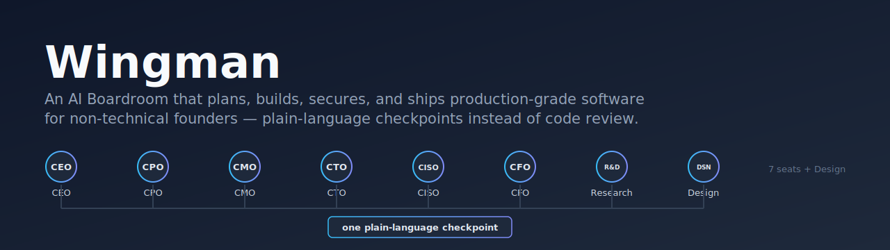
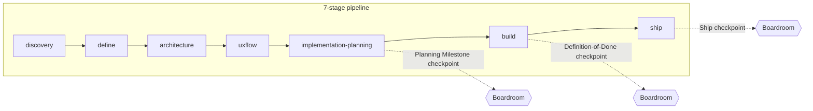

# Wingman

<p align="center">
  
</p>

<p align="center">
  <a href="https://github.com/LabLaunchPad/Wingman/actions/workflows/validate.yml"></a>
  <a href="https://github.com/LabLaunchPad/Wingman/actions/workflows/install-smoke.yml"></a>
  <a href="https://github.com/LabLaunchPad/Wingman/actions/workflows/actionlint.yml"></a>
  <a href="https://github.com/LabLaunchPad/Wingman/actions/workflows/codeql.yml"></a>
  <a href="LICENSE"></a>
</p>

Wingman is a [Claude Code](https://claude.com/product/claude-code) plugin that gives non-technical founders a full AI SDLC — an AI Boardroom of agents that plans, builds, secures, and ships production-grade software end to end, with plain-language checkpoints instead of code review.

**At a glance:**

| | |
|---|---|
| **Plugin surface** | Commands, skills, and 8 fixed Boardroom seats — run `node scripts/wingman-health.mjs` for the live command/skill counts |
| **Eval coverage** | Behavioral eval cases across `verified`/`provisional` trust levels — run `node scripts/wingman-health.mjs` for the live count and split |
| **Current release** | See [`CHANGELOG.md`](CHANGELOG.md) for the current version and history |
| **Install target** | Claude Code marketplace + plugin (`.claude-plugin/marketplace.json`) |
| **Runtime dependencies** | None — markdown + one dependency-free Node hook script |

## Quickstart

```
/plugin marketplace add LabLaunchPad/Wingman
/plugin install wingman
```

Then run `/wingman:discovery` to start a new project, or `/wingman:boardroom` to get a plain-language review of work already in progress. Every `wingman:*` command is listed in [`plugins/wingman/.claude-plugin/plugin.json`](plugins/wingman/.claude-plugin/plugin.json).

## How it works

Instead of asking a founder to read code or a diff, Wingman gates every stage of the SDLC through a **Boardroom checkpoint**: 7 C-suite-style seats plus Design (CEO / CPO / CMO / CTO / CISO / CFO / Research / Design) examine the plan or change in parallel and hand back one short, jargon-free go/no-go summary, consolidated into a grouped Business / Technical / Finance / Research report. The founder makes the call; Wingman never assumes silence means approval.



Only **3 founder-visible checkpoints** exist across the 7 stages — the 5 planning stages bundle into one review at the end of `implementation-planning`, then `build` (which folds in the security pass) and `ship` each keep their own. See [`docs/ARCHITECTURE.md`](docs/ARCHITECTURE.md) §4/§4b for the exact mapping.

The agent population is deliberately **lazy, not exhaustive**:

- A fixed **7+1-seat Boardroom** is always present — it only renders verdicts, never writes code.
- A small set of **department leads** (Product, Engineering, QA always active; Design, Data, Legal/Security, DevOps, Growth created only when a project's real complexity calls for them) do the actual build-time work.
- A **Management Board** of coordinators activates only once a project crosses 3+ active conditionally-created department leads.
- Narrow **specialists** (a 56-role candidate catalog) are promoted one at a time via `/wingman:evolve`, only after proven, repeated need — never bulk-created.

See [`docs/ARCHITECTURE.md`](docs/ARCHITECTURE.md) for the full model and [`docs/AGENT-ROSTER.md`](docs/AGENT-ROSTER.md) for the complete specialist catalog.

## Status

The pipeline is built and behaviorally tested, not just scaffolded:

- **Commands** — 7 named SDLC pipeline stages (`discovery` / `define` / `architecture` / `uxflow` / `implementation-planning` / `build` / `ship`) plus adaptive commands (`audit`, `boardroom`, `launch`, `hotfix`, `harness`, `telemetry`, `retro`, `learn`, `evolve`, `over-engineering-review`, `bloat-audit`, `debt-ledger`, `research`, `advisory`, `incident`, `dogfood`, `knowledge-export`).
- **Skills** covering discipline (`engineering-minimalism`, `verification-before-completion`), mechanics (`git-pr-workflow`, `security-checklist`), and adaptive output (`visual-founder-output`, `plain-language-checkpoint`).
- **8 fixed Boardroom seats** (7 C-suite-style + Design), dispatched in parallel and never writing code.

`evals/` holds a lightweight behavioral eval harness (not just structural validation): eval cases in a mix of `verified` (passed 2+ differently-shaped scenarios including a negative case) and `provisional` (passed one real run) — see `evals/README.md` for the trust-level bar. Covers every command and the high-value skills, including full end-to-end pipeline runs against realistic projects (one adversarial run producing a real `DO NOT SHIP`). Run `node scripts/wingman-health.mjs` for a live, read-only snapshot of these numbers straight from the repo — it's the source of truth this table is generated from, not a number to trust in prose.

See [`docs/PROJECT.md`](docs/PROJECT.md) for exact build/eval status and decisions log, and [`docs/ARCHITECTURE.md`](docs/ARCHITECTURE.md) for what's built versus deliberately deferred. Most of this was verified in a sandboxed testing environment; real dogfooding passes (actual `claude` CLI install, live pipeline runs via `/wingman:dogfood`) have also happened and found real gaps, now fixed — see [`docs/HUMAN-TODOS.md`](docs/HUMAN-TODOS.md) for what real dogfooding still needs.

## For humans and for agents

This README is written to be skimmed top-to-bottom in under a minute. If you're an AI coding agent working in this repo instead of a human reading it, start with [`AGENTS.md`](AGENTS.md) (a thin pointer into `CLAUDE.md`, the full project brief) rather than re-deriving conventions from source — and see `docs/ARCHITECTURE.md` §8a for the honest scope of what's portable to a non-Claude-Code harness today (two skills) versus what isn't (the rest).

## Documentation

- [`docs/ARCHITECTURE.md`](docs/ARCHITECTURE.md) — the hybrid Boardroom/department/specialist model and why it's shaped this way.
- [`docs/GOVERNANCE.md`](docs/GOVERNANCE.md) — a one-page index of where org governance, policy enforcement, and benchmarks/metrics each already live in this repo.
- [`docs/AGENT-ROSTER.md`](docs/AGENT-ROSTER.md) — the full specialist candidate catalog, organized by department.
- [`docs/PROJECT.md`](docs/PROJECT.md) — current build/eval status, decisions log, and roadmap.
- [`CHANGELOG.md`](CHANGELOG.md) — release history.
- [`docs/HUMAN-TODOS.md`](docs/HUMAN-TODOS.md) — what's blocked on a human rather than more engineering (publishing, demo content — see `docs/DEMO-CHECKLIST.md`).
- [`evals/README.md`](evals/README.md) — how the behavioral eval harness works and what's been verified.
- [`ATTRIBUTIONS.md`](ATTRIBUTIONS.md) — provenance for design patterns adapted from vendored reference repositories.
- [`SECURITY.md`](SECURITY.md) — vulnerability disclosure and this repo's actual trust boundaries.
- [`CONTRIBUTING.md`](CONTRIBUTING.md) — how to propose a change.

## License

[MIT](LICENSE)
