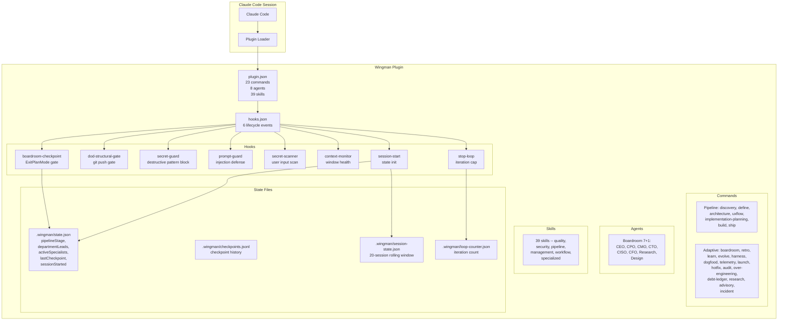
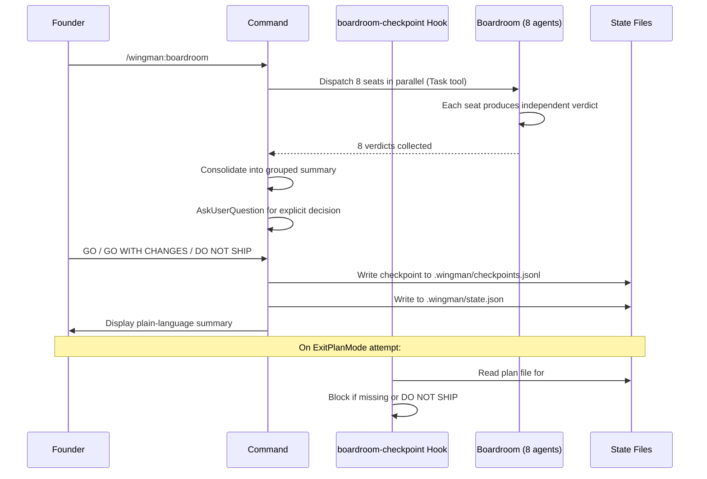
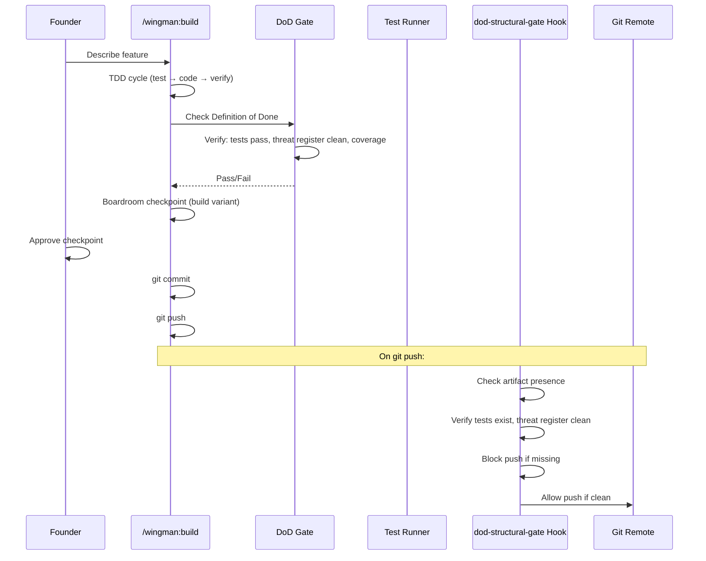
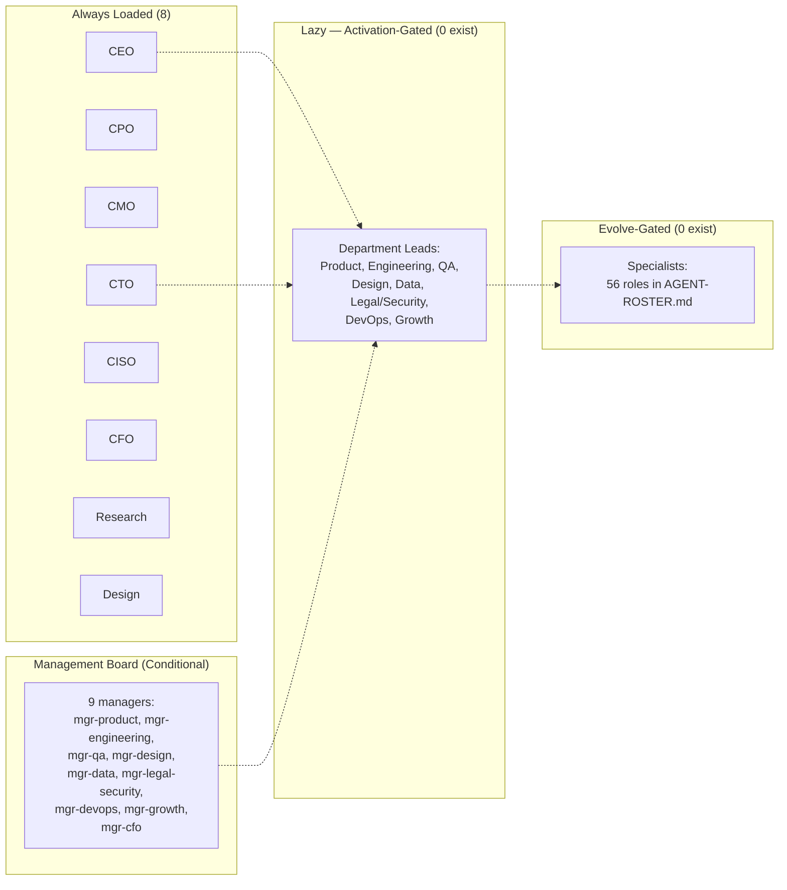

# Architecture & Data Assessment

## Component Model



## Data Flow — Boardroom Checkpoint



## Data Flow — Build Pipeline (build.md)



## State Persistence Schema

### `.wingman/state.json`
```json
{
  "pipelineStage": "discovery|define|architecture|uxflow|implementation-planning|build|ship",
  "departmentLeads": [],
  "activeSpecialists": [],
  "lastCheckpoint": null,
  "sessionStarted": "ISO 8601 timestamp"
}
```

### `.wingman/checkpoints.jsonl`
```jsonl
{"timestamp":"...", "stage":"build", "verdict":"GO", "seats":[{"seat":"CEO","verdict":"GO","rationale":"..."}, ...]}
```

### `.wingman/session-state.json`
```json
{
  "sessions": [
    {"id":"...", "timestamp":"...", "pipelineStage":"...", "summary":"..."}
  ],
  "previousSessionSummary": "..."
}
```
Max 20 sessions, FIFO eviction.

### `.wingman/loop-counter.json`
```json
{"iterationCount": 0}
```
Reset to 0 on stop, incremented on continue. Max 50 by default.

## Agent Topology



**Key rule (FR-6)**: No agent may invoke another agent. Only commands orchestrate/dispatch via the Task tool.

## Command Dispatch Architecture

```mermaid
graph TB
    subgraph "Founder Input"
        F[/wingman:command\n$ARGUMENTS]
    end

    subgraph "Plugin Loader"
        PR[plugin.json frontmatter]
        AG[argument-hint parsing]
    end

    subgraph "Lifecycle Hooks"
        PH[PreToolUse matchers]
        PO[PostToolUse]
        SS[SessionStart]
        SP[Stop]
        UP[UserPromptSubmit]
    end

    subgraph "Command Execution"
        C[Command markdown\nruns inline]
        C -->|Task tool| A[Agents]
        C --> S[Skills auto-trigger\nby description]
    end

    F --> PR
    PR --> C
    C --> PH
    C --> PO
    SS --> SZ[session-start.mjs]
    SP --> SL[stop-loop.mjs]
    UP --> SS2[secret-scanner.mjs]
    UP --> PG[prompt-guard.mjs]
```

## Key Architecture Constraints

1. **No circular dispatch**: Agents never invoke other agents; commands invoke agents
2. **Hooks fire on lifecycle events only** — no standalone execution outside Claude Code
3. **State is flat files** — no database, no external service
4. **Skills auto-trigger via description matching** — Claude Code's built-in routing, not custom
5. **Department leads created per-project** — never per-session or per-command
6. **Boardroom verdicts are independent** — parallel dispatch prevents bias
7. **Checkpoint files survive sessions** — .wingman/state.json persists across Claude Code sessions
