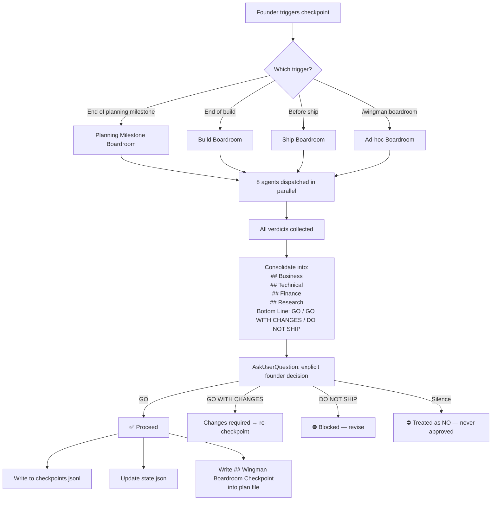
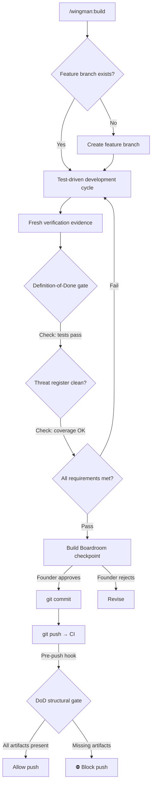
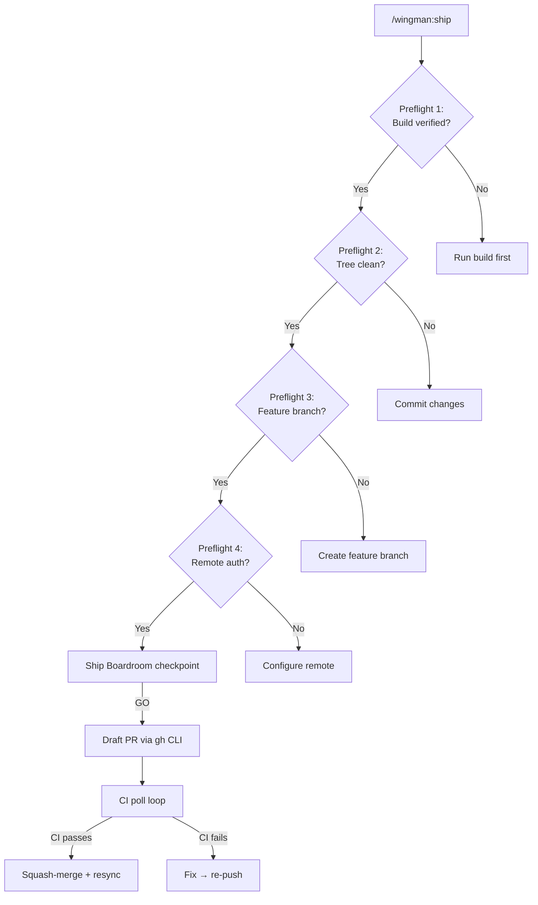
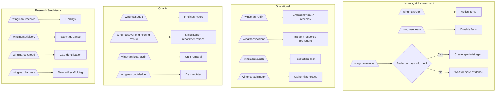

# User Flows

## Pipeline Flow — End to End

```mermaid
graph LR
    D[discovery] --> DF[define]
    DF --> A[architecture]
    A --> U[uxflow]
    U --> IP[implementation-planning]
    IP -->|Planning Milestone\nBoardroom Checkpoint| B[build]
    B -->|Build Checkpoint\nBoardroom]| S[ship]
    S -->|Ship Checkpoint\nBoardroom| Done[Done]

    style IP fill:#ff9900,color:#000
    style B fill:#ff9900,color:#000
    style S fill:#ff9900,color:#000
```

**3 founder-visible checkpoints** for 7 named stages. The 5 planning stages bundle into one "Planning Milestone" checkpoint at the end of `implementation-planning.md`.

## Boardroom Checkpoint Flow



## Build Flow (build.md)



## Ship Flow (ship.md)



## Adaptive Command Flows



## Boardroom Verdict Schema

Each verdict follows this structure:

```
## <SEAT> VERDICT: GO | GO_WITH_CONCERNS | NO_GO

**Assessment**: <1-2 sentence plain-language summary>

**Key Point**: <The single most important thing the founder needs to know>

**If NOT GO**: <What specifically would change this to GO>
```

Consolidated summary:

```
## Wingman Boardroom Checkpoint

### Business
- CEO: GO — ...
- CPO: GO — ...
- CMO: GO — ...

### Technical
- CTO: GO WITH CONCERNS — ...

### Finance
- CFO: GO — ...

### Research
- Research: GO — ...

### Design
- Design: GO — ...

**Bottom Line**: GO | GO WITH CHANGES | DO NOT SHIP
**Founder Decision**: <explicit, recorded>
```

## Human Escalation Framework

When a Boardroom verdict is `DO NOT SHIP` or the founder rejects:
1. Escalation is recorded in `checkpoints.jsonl`
2. The founder is offered specific, concrete changes that would flip the verdict
3. No silent override — founder must explicitly accept or reject each concern
4. Re-escalation after changes re-dispatches the full Boardroom (not a subset)
