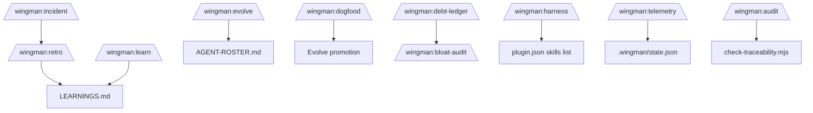

# Operational Playbooks

## Overview

Wingman provides 16 adaptive commands for non-pipeline operations. This document catalogs each playbook with its trigger, workflow, and integration points.

## Retrospective (`/wingman:retro`)

**Purpose**: Capture project retrospectives after milestones or incidents.

**Flow**:
1. Trigger: `/wingman:retro` after any pipeline stage or milestone
2. Gather: session history, checkpoint log, incident record
3. Analyze: what went well, what went wrong, what to change
4. Output: documented retro in plan file with action items

**Integration**: Updates LEARNINGS.md with `wingman:log type=learning` entries. Action items tracked via `wingman:req` markers.

## Learn (`/wingman:learn`)

**Purpose**: Capture durable, reusable facts discovered during work.

**Flow**:
1. Trigger: `/wingman:learn` when a non-obvious insight emerges
2. Format: `wingman:log type=learning category=<area> status=active`
3. Output: Append to LEARNINGS.md

**Requirements**:
- Facts must be independently verifiable, not opinions
- Stale entries pruned during evolve pass
- Category must match known taxonomy (environment, tooling, process, security, hooks, pipeline)

## Evolve (`/wingman:evolve`)

**Purpose**: Promote a specialist or department lead from the AGENT-ROSTER.md catalog when evidenced need arises.

**Flow**:
1. Trigger: Repeated friction on a specific task type (3+ occurrences documented)
2. Evidence collection: Gather session logs showing the pattern
3. Presentation: Plain-language summary of what specialist would do, why now, cost/benefit
4. Founder approval: Explicit yes/no via AskUserQuestion (FR-11)
5. Creation: Write agent file to founder's project (not to Wingman plugin itself)
6. Verification: Validate structure, update manifests

**Gate**: Must not create speculatively — only on evidenced, repeated need.

## Harness (`/wingman:harness`)

**Purpose**: Scaffold a new skill SKILL.md from a template.

**Flow**:
1. Trigger: `/wingman:harness` when a new skill is needed
2. Output: SKILL.md following the architecture standard (When to Use → Core Workflow → Constraints → Rationalizations → Red Flags → Verification → Output)
3. Registration: Updated in plugin.json skills list

## Dogfood (`/wingman:dogfood`)

**Purpose**: Run the real pipeline end to end against a throwaway project to find behavioral gaps.

**Flow**:
1. Setup: Create or identify a throwaway project
2. Execute: Run full pipeline (discovery → define → architecture → uxflow → implementation-planning → build → ship)
3. Observe: Note behavioral gaps, unexpected outcomes
4. Classify: Each gap evaluated per dogfood-gap-classification skill
5. Promote (maintainer mode only): Winning gaps promoted into `plugins/wingman/` itself

**Two fixture types**: `setup-dogfood-simple.sh` (trivial) and `setup-dogfood-complex.sh` (multi-file).

## Telemetry (`/wingman:telemetry`)

**Purpose**: Gather diagnostics about the session — what commands ran, hook hits, error counts.

**Flow**:
1. Trigger: `/wingman:telemetry`
2. Gather: Scan session state, checkpoint history, .wingman/ files
3. Output: Summary of session activity, performance notes

## Launch (`/wingman:launch`)

**Purpose**: Production push — deploy the built artifact.

**Flow**:
1. Preflight: Verify build exists, tests pass, latest on target branch
2. Execute: Deploy via configured mechanism
3. Verify: Check deployment succeeded, smoke test

## Hotfix (`/wingman:hotfix`)

**Purpose**: Emergency patch for production issues.

**Flow**:
1. Detection: Incident identified (or /wingman:incident triggered)
2. Branch: Create hotfix branch from production tag
3. Fix: Apply minimal patch (no scope creep)
4. Verify: Run tests, verify fix
5. Deploy: Push to production
6. Retro: Create follow-up retro for root cause analysis

**Two eval fixtures**: `setup-hotfix-fixture.sh` (basic) and `setup-hotfix-hard-fixture.sh` (subtle regression).

## Incident Response (`/wingman:incident`)

**Purpose**: Structured incident response procedure.

**Flow**:
1. Triage: Severity assessment
2. Contain: Stop the bleeding
3. Investigate: Root cause analysis
4. Remediate: Apply fix
5. Review: Document lessons learned

**Integration**: Creates retro entry, updates LEARNINGS.md with findings.

## Audit (`/wingman:audit`)

**Purpose**: Multi-angle systematic audit of a concern.

**Flow**:
1. Define scope (the concern to audit)
2. Cross-check: Verify claims against actual source code
3. Report: Structured findings (CRITICAL/MAJOR/MINOR)
4. Verify: Each finding validated against real execution

**Skill**: `systematic-auditing` provides the audit methodology.

## Over-Engineering Review (`/wingman:over-engineering-review`)

**Purpose**: Identify over-engineered solutions and recommend simplification.

**Flow**:
1. Scan project for complexity signals (unnecessary abstractions, over-parameterization)
2. Recommend concrete simplifications
3. Prioritize by impact

## Bloat Audit (`/wingman:bloat-audit`)

**Purpose**: Identify unused code, dead files, dependency cruft.

**Flow**:
1. Scan for dead code, orphaned files, unused exports
2. Report with removal recommendations
3. Track in debt ledger

## Debt Ledger (`/wingman:debt-ledger`)

**Purpose**: Track technical debt over time.

**Flow**:
1. Scan for debt signals (TODO, FIXME, HACK, workarounds)
2. Categorize (architecture, code quality, testing, documentation)
3. Prioritize with estimated effort
4. Update ledger file

## Research (`/wingman:research`)

**Purpose**: Fact-finding on open questions.

**Flow**:
1. Ask a research question in plain language
2. Agent gathers information (WebFetch)
3. Returns structured findings with sources
4. Trust levels: `provisional` → `verified` after multiple scenarios

**Skill**: `research` skill guides the methodology.

## Advisory (`/wingman:advisory`)

**Purpose**: Expert guidance on a specific domain question.

**Flow**:
1. Describe the domain decision context
2. Advisory agent provides guidance with rationale
3. Output includes options, tradeoffs, recommendation

## Adaptive Command Dependency Map

