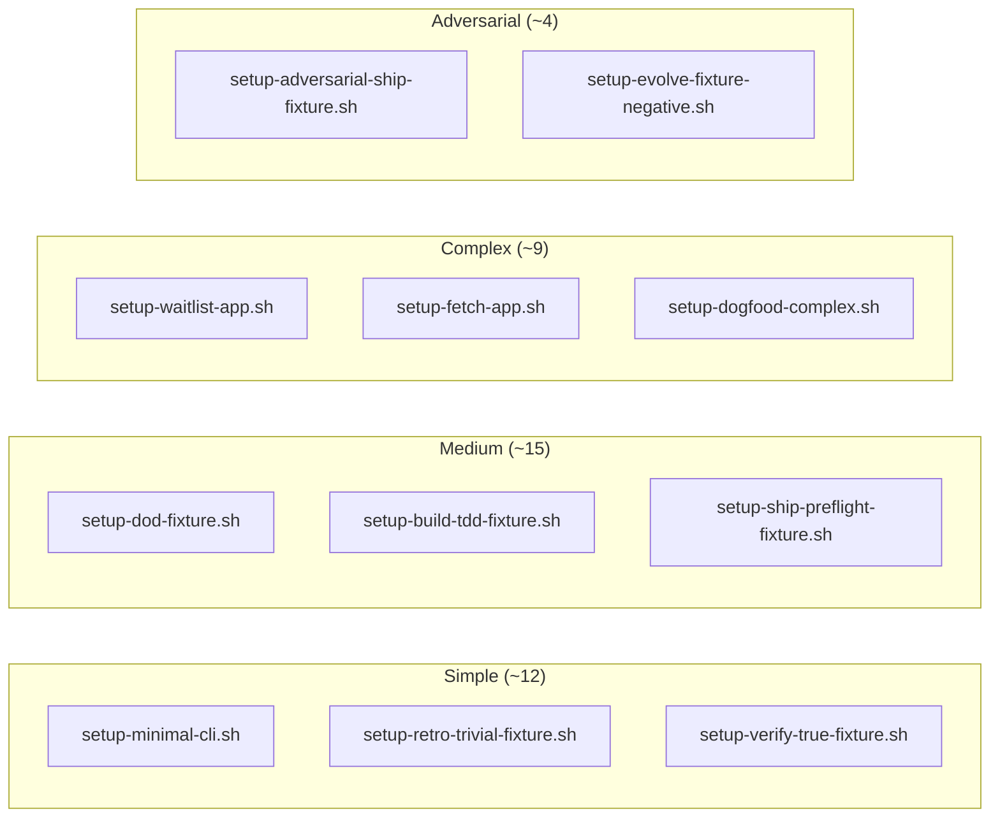

# Testing & Quality Assessment

## Test Architecture

```mermaid
graph TB
    subgraph "Layer 1 — Mechanical Validators"
        VS[validate-structure.mjs\nFrontmatter, refs, uniqueness]
        CRC[check-repo-consistency.mjs\nDoc integrity, attributions]
        CT[check-traceability.mjs\nMarker cross-referencing]
        CF[check-fixtures.mjs\nAll 36 fixtures run clean]
    end

    subgraph "Layer 2 — Integration Tests"
        HI[hooks-integration.test.mjs\n72 tests — all hook scripts]
    end

    subgraph "Layer 3 — Behavioral Evals"
        RH[run-headless.mjs\n62 eval cases, 36 fixtures]
        RH -->|integrity pass| Integrity[Every case references\nexisting fixture]
        RH -->|--dry-run| DryRun[Print plan, exit 0]
        RH -->|live + API key| Live[Run via claude -p\ncapture transcript]
    end

    subgraph "Layer 4 — Manual Grading"
        MG[Human grades transcript\nagainst expectations,\nnever trusting self-report]
        MG -->|Pass| Verified[verified trust level]
        MG -->|Fail| Provisional[provisional —\nneeds more scenarios]
    end

    subgraph "CI Pipeline (GitHub Actions)"
        V[validate] --> A[actionlint]
        A --> IS[install-smoke]
        IS --> VG[version-gate]
        VG --> EV[evals workflow\n(scheduled + per-PR)]
    end
```

## Test Counts & Results

| Suite | Count | Last Result | Notes |
|---|---|---|---|
| hooks-integration.test.mjs | 72 | ✅ 72/72 pass | Includes 4 new max-iteration tests, generic key test |
| validate-structure.mjs | — | ✅ PASS | 23 commands, 8 agents, 39 skills |
| check-repo-consistency.mjs | — | ✅ PASS | Doc/attribution invariants |
| check-traceability.mjs | — | ✅ PASS | Marker cross-referencing, 0 warnings post-fix |
| check-fixtures.mjs | 36 | ⚠️ 0/36 (skipped) | Windows — no bash available; CI-only |
| run-headless.mjs --dry-run | 62 | ⚠️ Deep mode | Dry-run only on Windows (no bash/API key) |

## Eval Coverage by Category

### Commands (20/23 covered, 87%)

| Category | Total | Covered | Gap |
|---|---|---|---|
| Pipeline stages | 7 | 2 dedicated + 1 shared e2e | 5 pipeline commands covered by e2e |
| Adaptive — Learning | 3 | 3 | None |
| Adaptive — Operational | 5 | 5 | None |
| Adaptive — Quality | 4 | 4 | None |
| Adaptive — Research | 3 | 3 | None |

### Skills (39/39 covered, 100%)

| Category | Total | Covered | Notes |
|---|---|---|---|
| Quality discipline | 9 | 9 | verification-before-completion, writing-plans, etc. |
| Security | 3 | 3 | security-checklist, doubt-driven-development, anti-rationalization |
| Pipeline integration | 7 | 7 | plain-language-checkpoint, definition-of-done, etc. |
| Management | 3 | 3 | management-board-activation, evidence-gated-catalog, evolve-promotion |
| Workflow | 5 | 5 | git-pr-workflow, department-lead-activation, etc. |
| Specialized | 12 | 12 | memory, council, plan, simplify, etc. |

### Agents (8/8 covered, 100%)

All 8 Boardroom seat agents covered by boardroom-7-seat.md eval case.

## Eval Fixtures — Realism Spectrum



## Integration Test Coverage (Hooks)

| Hook Script | Test Count | Key Tests |
|---|---|---|
| boardroom-checkpoint.mjs | ~15 | ExitPlanMode block, verdict parsing, missing section detection |
| dod-structural-gate.mjs | ~10 | Git push regex, artifact presence, fail-open behavior |
| secret-guard.mjs | ~10 | All 6 destructive patterns, all 6 secret patterns |
| secret-scanner.mjs | ~8 | Generic key detection, false positive avoidance |
| stop-loop.mjs | ~8 | Evaluate function, iteration counter (4 new tests) |
| prompt-guard.mjs | ~8 | Self-reference filter, injection detection |
| session-start.mjs | ~5 | State initialization, session history rolling window |
| context-monitor.mjs | ~4 | Context window measurement |

## Quality Metrics

| Metric | Value |
|---|---|
| Eval cases with `verified` trust level | ~50/62 |
| Eval cases with `provisional` trust level | ~12/62 |
| Cases using `no-fixture-needed` | ~10 |
| Integration test pass rate | 100% (72/72) |
| Validator pass rate (excluding bash-dependent) | 100% |
| Skills with dedicated eval | 39/39 (100%) |
| Commands with dedicated eval | 20/23 (87%) |
| Pipeline-stage commands with individual eval | 2/7 (29%) + 1 shared e2e |

## Testing Gaps

1. **5 pipeline-stage commands** lack individual eval cases — currently covered by `seven-stage-pipeline-e2e.md`; individual cases were added during this audit but have not yet been run live (no ANTHROPIC_API_KEY)
2. **No performance/stress tests** — 50-iteration cap in stop-loop is the closest thing to a load test
3. **No end-to-end adversarial tests** for pipeline commands — adversarial fixtures exist only for ship and evolve
4. **Windows CI** — `check-fixtures.mjs` and `run-headless.mjs` skip on Windows; no GitHub Actions Windows runner configured
5. **No fuzz testing** — secret patterns are regex-based, no random input generation
6. **No regression test suite for governance docs** — structural checks exist, but semantic drift (e.g., ARCHITECTURE.md out of sync with code) is not mechanically caught
