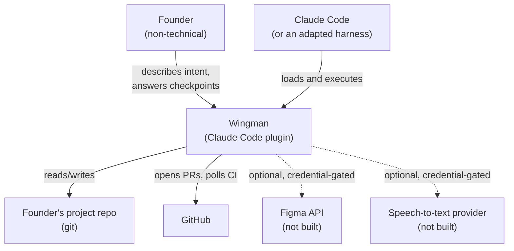
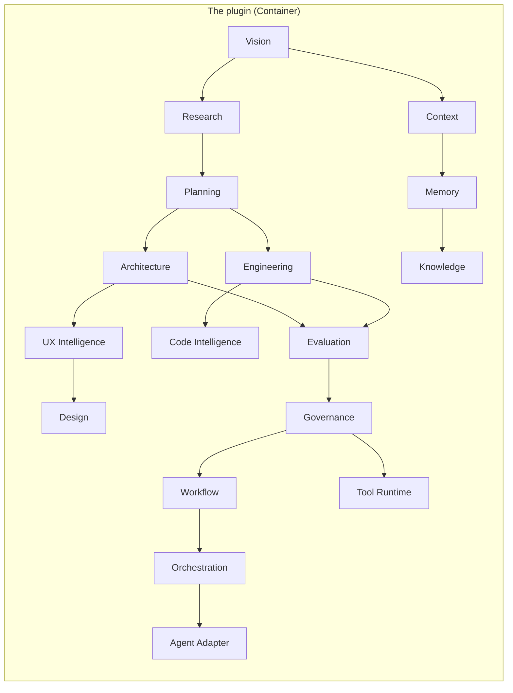

# Wingman — C4 Architecture Mapping

Added 2026-07-30 (Layer 13 of a 19-layer validation pass). **This is a mapping layer, not a new
architecture** — it names which existing artifact answers each of C4's four levels (Context,
Container, Component, Code), rather than drawing parallel diagrams that would duplicate
`docs/status/ARCHITECTURE.md` and the 17 `engines/*/ENGINE.md` manifests. Per the C4 model's own
guidance: not every system needs all four levels drawn out, and Context + Container is often enough
— Wingman's genuinely novel level is Component (the 17 engines), so that's where this document
puts its actual weight.

## Level 1 — System Context

Who and what Wingman talks to, at the coarsest grain.

**Confirmed, not assumed**: the dotted lines (Figma, speech-to-text) are real — `docs/HUMAN-TODOS.md`
names both as credential-gated and not built, so they're drawn as absent dependencies, not aspirational
ones.

## Level 2 — Containers

C4's "container" = a separately deployable/runnable unit. Wingman genuinely has few of these — most
of the system lives inside one container (the plugin itself, loaded into the host process).

| Container | What it is | Status |
|---|---|---|
| **The plugin** | Markdown commands/agents/skills + `hooks.json` + `.mjs` scripts, loaded via `plugin.json` | Built — this is almost the entire system |
| **Harness adapters** | Generated per-harness ports (Codex CLI, OpenCode, Gemini CLI, Cursor, Cline, OpenHands) | Built, ~230 generated files — see `ARCHITECTURE.md` §8b |
| **Local MCP server** | A stdio child-process the host would start, exposing checkpoint history as a queryable resource | **Planned, not yet justified** — `DATABASE.md` §"Why no server yet" |
| **`~/.wingman/` (Global/Org tiers)** | File-backed state outside any repo, opened on demand | Built (Memory Engine, PR5) |

**No hosted service, no database server, no always-on process** — confirmed by `ARCHITECTURE.md` §2 and CI-enforced by `install-smoke.yml` (asserts `node_modules` never appears, so no runtime dependency could stand up a server even accidentally).

## Level 3 — Components

**This is where Wingman's real architectural granularity lives.** The 17 `engines/*/ENGINE.md`
manifests **are** the component level — each already declares purpose, inputs, output artifacts,
members, state read/written, escalation, and permitted tool tier, which is a superset of what a C4
component diagram typically shows. This document does not repeat that content; see
`docs/status/ENGINES.md` for the index and each `ENGINE.md` for its own detail.

**Note on this diagram**: edges show the real dependency direction between engines (e.g. Planning
reads Architecture's requirements; Evaluation reads Engineering's build output) — traced from each
engine's own "State read + written" section, not invented. It is illustrative, not exhaustive; the
authoritative dependency source is each `ENGINE.md` file itself.

## Level 4 — Code

C4's code level (classes/functions) is intentionally **not diagrammed** here — at Wingman's actual
scale (markdown files + small `.mjs` scripts, no classes, no OOP hierarchy), a UML-style code diagram
would show file-to-file `import` relationships that are already fully visible in the files themselves
and in `scripts/validate-engines.mjs`'s real-time ownership check. Drawing one would be exactly the
"add a diagram to match vocabulary" anti-pattern this mapping exercise was asked to avoid. The real
code-level artifact is the 17 `ENGINE.md` "Members" lists — each names the actual files.

## Why this document exists, and what it deliberately doesn't do

- **Does not replace** `docs/status/ARCHITECTURE.md` (the narrative "why") or the 17 `ENGINE.md`
  manifests (the actual component contracts) — it's a thin index mapping existing artifacts onto a
  named methodology, requested specifically because a validation framework asked for "C4-style
  thinking" and found no explicit mapping.
- **Does not add a Level-4 diagram** — reasoned above as genuinely unnecessary at this scale, not
  skipped for convenience.
- **Will drift if `ENGINE.md` files change** without a corresponding update here — same risk every
  other cross-referencing doc in this repo carries; no new mechanical check was added for this
  specifically, since a 17-node diagram changing shape is rare enough that `doc-index`'s existing
  discoverability discipline (an owning artifact citing it) is proportionate.

## Referenced by

- `docs/status/ARCHITECTURE.md`
- `docs/status/ENGINES.md`
