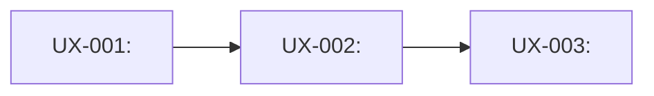
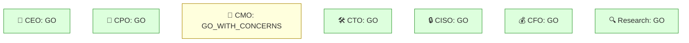

# Visual Output Templates — Cross-Command Reference

Concrete, copy-paste templates for `skills/visual-founder-output`. This file holds the actual
Mermaid/ASCII source so the skill's own prose doesn't have to embed large code blocks. Owned by
`skills/visual-founder-output`; cited from `commands/uxflow.md` and `commands/boardroom.md`.

Every template below has a Tier A (Artifact-capable) and Tier B (universal fallback) version — see
`skills/visual-founder-output`'s Core Workflow for how to detect which tier applies before picking
one.

---

## 1. UX flow diagram (`commands/uxflow.md`)

Generated from the same `UX-*` rows as the existing table — never a hand-authored parallel version.

**Tier B (Mermaid, universal fallback):**



- One node per `UX-*` row, labeled with its ID and screen/state name.
- One edge per real transition a user actually takes, labeled with the action that causes it (the
  table's "User can..." column, shortened to the verb phrase).
- Keep node labels short (screen name only) — the full "User can..." detail stays in the table;
  the diagram's job is showing *order and branching*, not restating every cell.

**Tier A (Artifact, low-fidelity wireframe):** one simple HTML page per key screen — a bordered box
per major UI region (header/nav, primary content area, primary action), text labels only, no color
system or real CSS framework. This is a shape-of-the-experience sketch, not a designed mockup —
`design-taste` owns actual visual polish at build time. Link screens together with plain anchor
navigation matching the flow's edges.

---

## 2. Pipeline-status tree (`commands/boardroom.md`'s "Where you are" section)

Rendered fresh each time from `.wingman/state.json` (`current_stage`) and `.wingman/checkpoints.jsonl`
(which checkpoints have actually been recorded) — never hand-maintained, never a new state file.

**Tier B (ASCII, universal fallback):**

```
Wingman pipeline
├─ Planning Milestone  [discovery → define → architecture → uxflow → implementation-planning]
│    ✔ done — cleared 2026-07-15
├─ Build
│    ▶ you are here
└─ Ship
     ○ not started
```

- Three rows only — Planning Milestone, Build, Ship — matching the 3 real founder-visible
  checkpoints (not all 7 pipeline stages; the 5 planning-stage names appear once, bracketed, inside
  the Planning Milestone row, since they never get their own checkpoint).
- Marker legend: `✔ done` (checkpoint recorded, `GO` or founder chose "ship it" after `GO WITH
  CHANGES`), `▶ you are here` (current stage per `state.json`), `○ not started`.
- If the current/most recent checkpoint's `bottom_line` was `DO NOT SHIP`, replace `▶ you are here`
  with `✖ blocked — see concerns below` on that row.

**Tier A (Artifact, rendered status strip):** the same three-row structure as a small horizontal
step indicator (three labeled segments, current segment highlighted, done segments checked) — no
extra chrome, no separate app shell; this is one small element inside the boardroom report's
Artifact, not a standalone dashboard.

---

## 3. Boardroom seat-verdict grid (`commands/boardroom.md`'s "What each seat said" section)

Additive to the existing emoji-line format — do not remove the one-line-per-seat text, since that's
what `plain-language-checkpoint` output already reads cleanly even with zero rendering.

**Tier B (Mermaid, universal fallback):**



- One node per seat that actually returned a verdict this checkpoint (omit Design's node when it
  was N/A, same as the existing text format already does).
- Color class by verdict (`go`/`changes`/`noGo`) — this is the one place color genuinely adds signal
  a founder can scan in under a second; don't extend color-coding elsewhere in the report.

**Tier A (Artifact):** a small grid of verdict cards (seat name + icon + one-line verdict + color),
laid out in the same Business/Technical/Finance/Research groups the text format already uses.

---

## Constraints shared by all three templates

- Every template is generated from data Wingman already has (the `UX-*` table, `state.json`,
  `checkpoints.jsonl`, the seats' own verdict lines) — never a new hand-maintained source.
- Tier B must degrade to something a plain-terminal reader can still parse as structured information,
  even with zero diagram rendering — this is why the ASCII tree above reads correctly as plain text.
- Keep every label plain-language per `plain-language-checkpoint` — a diagram node reading
  `NULL_POINTER_EXC` instead of a translated consequence fails the checkpoint just as badly as a
  prose sentence would.
