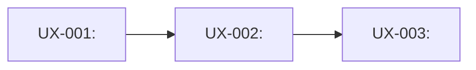
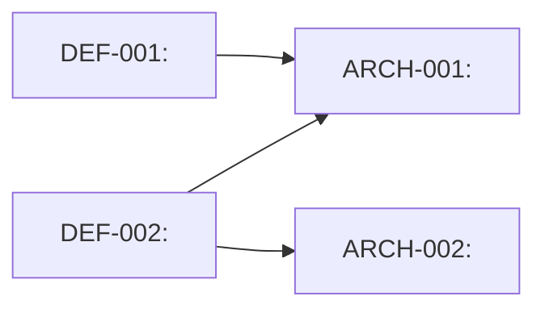
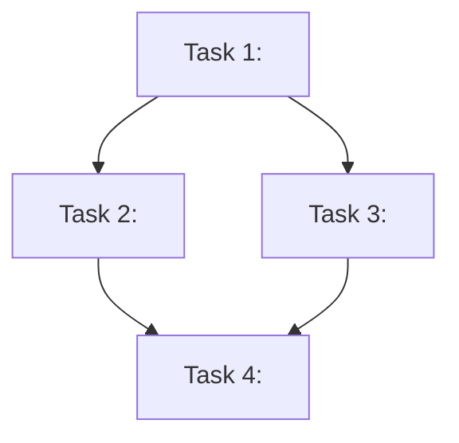

# Visual Output Templates — Cross-Command Reference

Concrete, copy-paste templates for `skills/visual-founder-output`. This file holds the actual
Mermaid/ASCII source so the skill's own prose doesn't have to embed large code blocks. Owned by
`skills/visual-founder-output`; cited from all 7 pipeline commands (`discovery.md`, `define.md`,
`architecture.md`, `uxflow.md`, `implementation-planning.md`, `build.md`, `ship.md`) and
`boardroom.md`.

**Which template applies where:** §2 (pipeline-status tree) is generic and used by all 7 pipeline
commands plus `boardroom.md`, for consistent orientation at every stage — not just at a checkpoint.
§1 (UX flow), §3 (seat-verdict grid), §4 (DEF→ARCH graph), and §5 (task-dependency diagram) are each
specific to the one command named in their heading, because their content only has real diagram
shape in that one place — see `skills/visual-founder-output`'s Red Flags before reusing any of them
somewhere its content doesn't actually have that shape (a flat field list or an independent-item
table, like `discovery.md`'s output or `define.md`'s requirements, does not get a forced diagram).

Every template below has a Tier A (Artifact-capable) and Tier B (universal fallback) version — see
`skills/visual-founder-output`'s Core Workflow for how to detect which tier applies before picking
one.

---

## 1. UX flow diagram (`commands/pipeline/uxflow.md`)

Generated from the same `UX-*` rows as the existing table — never a hand-authored parallel version.

**Tier B (Mermaid, universal fallback):**



- One node per `UX-*` row, labeled with its ID and screen/state name.
- One edge per real transition a user actually takes, labeled with the action that causes it (the
  table's "User can..." column, shortened to the verb phrase).
- Keep node labels short (screen name only) — the full "User can..." detail stays in the table;
  the diagram's job is showing *order and branching*, not restating every cell.

**Tier A (Artifact, low-fidelity wireframe):** one simple HTML page per key screen — a bordered box
per major UI region (header/nav, primary content area, primary action), text labels only, no color
system or real CSS framework. This is a shape-of-the-experience sketch, not a designed mockup —
`design-taste` owns actual visual polish at build time. Link screens together with plain anchor
navigation matching the flow's edges.

---

## 2. Pipeline-status tree (every pipeline command's "Where you are" section)

Rendered fresh each time from `.wingman/state.json` (`current_stage`) and `.wingman/checkpoints.jsonl`
(which checkpoints have actually been recorded) — never hand-maintained, never a new state file.

**Tier B (ASCII, universal fallback):**

```
Wingman pipeline
├─ Planning Milestone  [discovery → define → architecture → uxflow → implementation-planning]
│    ✔ done — cleared 2026-07-15
├─ Build
│    ▶ you are here
└─ Ship
     ○ not started
```

- Three rows only — Planning Milestone, Build, Ship — matching the 3 real founder-visible
  checkpoints (not all 7 pipeline stages; the 5 planning-stage names appear once, bracketed, inside
  the Planning Milestone row, since they never get their own checkpoint).
- Marker legend: `✔ done` (checkpoint recorded, `GO` or founder chose "ship it" after `GO WITH
  CHANGES`), `▶ you are here` (current stage per `state.json`), `○ not started`.
- If the current/most recent checkpoint's `bottom_line` was `DO NOT SHIP`, replace `▶ you are here`
  with `✖ blocked — see concerns below` on that row.

**Mid-planning variant** (`discovery.md`/`define.md`/`architecture.md`/`uxflow.md` — no Planning
Milestone checkpoint recorded yet): mark the Planning Milestone row `▶ you are here` too, and add
which of the 5 bracketed sub-stages is current so a founder isn't stuck reading "you are here" next
to a 5-name list with no indication of progress within it:

```
Wingman pipeline
├─ Planning Milestone  [discovery → define → architecture → uxflow → implementation-planning]
│    ▶ you are here — currently: architecture
├─ Build
│    ○ not started
└─ Ship
     ○ not started
```

The current sub-stage is simply which command just ran (`architecture.md` running this step means
`currently: architecture`) — no new state field, read from which command produced this output.

**Tier A (Artifact, rendered status strip):** the same three-row structure as a small horizontal
step indicator (three labeled segments, current segment highlighted, done segments checked) — no
extra chrome, no separate app shell; this is one small element inside the boardroom report's
Artifact, not a standalone dashboard.

---

## 3. Boardroom seat-verdict grid (`commands/adaptive/boardroom.md`'s "What each seat said" section)

Additive to the existing emoji-line format — do not remove the one-line-per-seat text, since that's
what `plain-language-checkpoint` output already reads cleanly even with zero rendering.

**Tier B (Mermaid, universal fallback):**


- One node per seat that actually returned a verdict this checkpoint (omit Design's node when it
  was N/A, same as the existing text format already does).
- Color class by verdict (`go`/`changes`/`noGo`) — this is the one place color genuinely adds signal
  a founder can scan in under a second; don't extend color-coding elsewhere in the report.

**Tier A (Artifact):** a small grid of verdict cards (seat name + icon + one-line verdict + color),
laid out in the same Business/Technical/Finance/Research groups the text format already uses.

---

## 4. DEF→ARCH traceability graph (`commands/pipeline/architecture.md`)

Generated from the same `ARCH-*` rows (and their `Satisfies` column) as the existing table — never a
hand-authored parallel version. Unlike UX flow, this isn't a sequence a user moves through; it's a
mapping (which decisions satisfy which requirements, including the real case of one requirement
needing more than one decision, or one decision satisfying more than one requirement) — a graph, not
a flowchart with a single direction.

**Tier B (Mermaid, universal fallback):**



- One node per `DEF-*` requirement in scope and one per `ARCH-*` decision, edges following each
  decision's `Satisfies` column exactly (a decision satisfying two requirements gets two incoming
  edges; a requirement needing two decisions gets two outgoing edges — never collapse these).
- Keep node labels short (the requirement/decision name only) — the full rationale and reuse note
  stay in the table.

**Tier A (Artifact):** a simple two-column node-link diagram (requirements on the left, decisions on
the right, connecting lines) — no additional detail beyond what the table already states.

---

## 5. Task-dependency diagram (`commands/pipeline/implementation-planning.md`'s internal plan document)

The plan document itself is never shown to the founder directly (`boardroom.md`'s Planning Milestone
checkpoint is what they see) — this diagram is for whoever executes the plan (a fresh `build.md`
subagent, or a human maintainer), so ordering and dependency between tasks is visible at a glance
instead of only implied by task numbering.

**Tier B (Mermaid, universal fallback):**



- One node per task in the plan, edges only for a genuine dependency (task B needs task A's output
  or can't be tested until A exists) — not just numbering order. Independent tasks (no edge between
  them) can and should show as parallel branches, not forced into one chain.
- Append this diagram as its own subsection in the plan document (e.g. `## Task Dependencies`), after
  the task list — it illustrates the existing checkbox list, never replaces its exact-file/exact-step
  detail (see `skills/writing-plans`'s "No Placeholders" rule, which still governs the task list
  itself).

**Tier A (Artifact):** not typically warranted here — the plan document's own reader (an executing
agent or a maintainer reading raw markdown) doesn't benefit from a rendered Artifact the way a
founder reading a checkpoint does. Default to Tier B for this one regardless of session capability,
unless the founder has explicitly asked to see the plan directly.

---

## Constraints shared by all templates

- Every template is generated from data Wingman already has (the `UX-*`/`ARCH-*`/`DEF-*` tables, the
  plan's own task list, `state.json`, `checkpoints.jsonl`, the seats' own verdict lines) — never a
  new hand-maintained source.
- Tier B must degrade to something a plain-terminal reader can still parse as structured information,
  even with zero diagram rendering — this is why the ASCII tree above reads correctly as plain text.
- Keep every label plain-language per `plain-language-checkpoint` — a diagram node reading
  `NULL_POINTER_EXC` instead of a translated consequence fails the checkpoint just as badly as a
  prose sentence would.

## Cited by

- `plugins/wingman/skills/visual-founder-output/SKILL.md`
- `plugins/wingman/commands/adaptive/boardroom.md`
- `plugins/wingman/commands/pipeline/architecture.md`
- `plugins/wingman/commands/pipeline/build.md`
- `plugins/wingman/commands/pipeline/define.md`
- `plugins/wingman/commands/pipeline/discovery.md`
- `plugins/wingman/commands/pipeline/implementation-planning.md`
- `plugins/wingman/commands/pipeline/ship.md`
- `plugins/wingman/commands/pipeline/uxflow.md`
