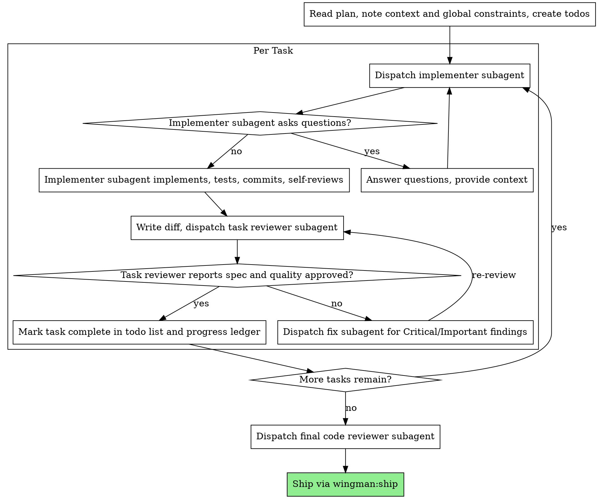

# Subagent-Driven Development

Execute plan by dispatching a fresh implementer subagent per task, a task review (spec compliance + code quality) after each, and a broad whole-branch review at the end.

**Why subagents:** You delegate tasks to specialized agents with isolated context. By precisely crafting their instructions and context, you ensure they stay focused and succeed at their task. They should never inherit your session's context or history — you construct exactly what they need. This also preserves your own context for coordination work.

**Core principle:** Fresh subagent per task + task review (spec + quality) + broad final review = high quality, fast iteration

**Narration:** between tool calls, narrate at most one short line — the ledger and the tool results carry the record.

**Continuous execution:** Do not pause to check in with your human partner between tasks. Execute all tasks from the plan without stopping. The only reasons to stop are: BLOCKED status you cannot resolve, ambiguity that genuinely prevents progress, or all tasks complete. "Should I continue?" prompts and progress summaries waste their time — they asked you to execute the plan, so execute it.

## Continuous Execution

See `references/continuous-execution.md` — maintain momentum through a workflow once started; don't pause to narrate or summarize mid-flight.


## When to Use

- You have an implementation plan with multiple tasks
- Tasks are mostly independent (not tightly coupled)
- You want to stay in the current session (no context switch)
- Tasks benefit from fresh context isolation

**vs. Parallel session execution:**
- Same session (no context switch)
- Fresh subagent per task (no context pollution)
- Review after each task (spec compliance + code quality), broad review at the end
- Faster iteration (no human-in-loop between tasks)

## The Process



## Pre-Flight Plan Review

Before dispatching Task 1, scan the plan once for conflicts:

- Tasks that contradict each other or the plan's Global Constraints
- Anything the plan explicitly mandates that the review rubric treats as a defect

Present everything you find as one batched question before execution begins. If the scan is clean, proceed without comment.

## Model Selection

Use the least powerful model that can handle each role to conserve cost and increase speed.

**Always specify the model explicitly when dispatching a subagent.** An omitted model inherits your session's model — often the most capable and most expensive. This is the most common cost leak.

**Turn count beats token price.** Wall-clock and context cost scale with how many turns a subagent takes. A cheap model that takes 6 turns costs more than a mid-tier model that finishes in 2. Use a mid-tier model as the floor for reviewers and for implementers working from prose descriptions. When the task's plan text contains the complete code to write, use the cheapest tier for that implementer.

### Model Tier Guide

| Role | Cheap (fastest) | Standard | Capable (slowest) |
|---|---|---|---|
| Implementer, mechanical | ✓ isolated functions, complete spec, 1-2 files | | |
| Implementer, integration | | ✓ multi-file, coordination, debugging | |
| Implementer, design | | | ✓ requires judgment, broad codebase |
| Task reviewer, small diff | ✓ clear spec, few changes | | |
| Task reviewer, risky diff | | ✓ concurrency, data flow, security | |
| Fix subagent | ✓ targeted fix with clear instructions | | |
| Final whole-branch review | | | ✓ always use the most capable |

### Cost Threshold Warnings

Before dispatching, check whether the task justifies the model:

- **Cheap tier:** Use freely. Most implementation tasks land here when the plan is well-specified. No cost warning needed.
- **Standard tier:** Use when cheap tier would likely take 3+ turns or miss integration concerns. Acceptable for most reviewers.
- **Capable tier:** Use only for architecture decisions, subtle correctness problems, or the final whole-branch review. If you find yourself reaching for the capable model on routine implementation, the plan likely needs better specifications, not a better model.

**Red flag:** If you are dispatching capable-tier subagents on more than 20% of tasks, stop — the plan needs re-specification, not expensive models.

## Handling Implementer Status

Implementer subagents report one of four statuses. Handle each appropriately:

**DONE:** Generate the review package, then dispatch the task reviewer with the diff file path.

**DONE_WITH_CONCERNS:** The implementer completed the work but flagged doubts. Read the concerns before proceeding. If concerns are about correctness or scope, address them before review. If they are observations (e.g., "this file is getting large"), note them and proceed to review.

**NEEDS_CONTEXT:** The implementer needs information that was not provided. Provide the missing context and re-dispatch.

**BLOCKED:** The implementer cannot complete the task. Assess the blocker:
1. If it is a context problem, provide more context and re-dispatch with the same model
2. If the task requires more reasoning, re-dispatch with a more capable model
3. If the task is too large, break it into smaller pieces
4. If the plan itself is wrong, escalate to the human

**Never** ignore an escalation or force the same model to retry without changes. If the implementer said it is stuck, something needs to change.

## Handling Review Items

The task reviewer may report "Cannot verify from diff" items — requirements that live in unchanged code or span tasks. These do not block the rest of the review, but you must resolve each one yourself before marking the task complete.

If you confirm an item is a real gap, treat it as a failed spec review — send it back to the implementer and re-review.

## Constructing Reviewer Prompts

Per-task reviews are task-scoped gates. The broad review happens once, at the final whole-branch review.

- Do not add open-ended directives like "check all uses" without a concrete, task-specific reason
- Do not ask a reviewer to re-run tests the implementer already ran
- Do not pre-judge findings for the reviewer — never instruct a reviewer to ignore or not flag a specific issue
- The global-constraints block you hand the reviewer is its attention lens. Copy the binding requirements verbatim.
- Hand the reviewer its diff as a file, not pasted text
- A dispatch prompt describes one task, not the session's history
- Dispatch fix subagents for Critical and Important findings
- A finding labeled plan-mandated is the human's decision, like any plan contradiction
- The final whole-branch review gets the complete branch diff as a file
- Every fix dispatch carries the implementer contract: re-run covering tests, report results
- If the final whole-branch review returns findings, dispatch ONE fix subagent with the complete findings list

## File-Based Context Handoffs

Everything you paste into a dispatch prompt stays resident in your context for the rest of the session. Context is finite — every line you paste into a dispatch prompt is a line you can no longer use for coordination. Hand artifacts over as files instead.

- **Task brief:** Extract the task's full text to a uniquely named file (e.g., `.wingman/sdd/task-1-brief.md`). Your dispatch should contain: (1) one line on where this task fits in the project; (2) the brief path, introduced as "read this first — it is your requirements"; (3) interfaces and decisions from earlier tasks that the brief cannot know; (4) your resolution of any ambiguity; (5) the report-file path and report contract.
- **Report file:** Name the implementer's report file after the brief (`task-N-brief.md` → `task-N-report.md`). The implementer writes the full report there and returns only status, commits, a one-line test summary, and concerns. Never paste report content back into your context.
- **Review packages:** Generate the review package (diff file, test results) via scripts, not by pasting output. The reviewer gets file paths, not inline content.
- **Fix reports:** Fix subagents append their findings to the same report file, never create a new file. The report file becomes the complete audit trail for the task.
- **Reviewer inputs:** The task reviewer gets three paths — the same brief file, the report file, and the review package — plus the global constraints. No inline diffs, no pasted test output.

See `references/context-handoffs.md` for the complete file naming convention and dispatch templates.

## Durable Progress Ledger

Conversation memory does not survive compaction. Track progress in a ledger file (`.wingman/sdd/progress.md`), not only in todos. The ledger is the single source of truth for what has been completed.

**Why this matters:** The single most expensive failure in multi-task execution is re-dispatching completed task sequences because you lost track. A ledger survives compaction — your context does not.

### Ledger Protocol

- **At skill start:** Check for an existing ledger. Tasks listed as complete are DONE — do not re-dispatch them. Verify each "complete" entry against `git log --oneline` to confirm the commits exist.
- **After each clean review:** Append one line to the ledger immediately: `Task N: complete (commits X..Y, review clean, model used)`.
- **After compaction:** Trust the ledger and `git log` over your own recollection. Read the ledger, verify commits exist, then resume from the first incomplete task.
- **Ledger format:** One line per task, append-only. Never edit or remove past entries. See `references/progress-ledger.md` for the full template and rules.

### Recovery Protocol (post-compaction)

1. Read `.wingman/sdd/progress.md`
2. For each "complete" entry, verify commits exist: `git log --oneline <commit-range>`
3. Confirm the branch state matches what the ledger describes
4. Resume from the first task not marked complete
5. If the ledger and git log disagree, trust git log and correct the ledger

## Example Workflow

```
You: I'm using Subagent-Driven Development to execute this plan.

[Read plan file once]
[Create todos for all tasks]

Task 1: Hook installation script

[Extract task brief to file; dispatch implementer with brief + report paths + context]

Implementer: "Before I begin - should the hook be installed at user or system level?"

You: "User level (~/.config/wingman/hooks/)"

Implementer: "Got it. Implementing now..."
[Later] Implementer:
  - Implemented install-hook command
  - Added tests, 5/5 passing
  - Self-review: Found I missed --force flag, added it
  - Committed

[Dispatch task reviewer with the diff file]
Task reviewer: Spec met, all requirements satisfied. Task quality: Approved.
  Strengths: Good test coverage, clean. Issues: None.

[Mark Task 1 complete]

Task 2: Recovery modes

[Extract task brief to file; dispatch implementer with brief + report paths + context]

Implementer: [No questions, proceeds]
Implementer:
  - Added verify/repair modes
  - 8/8 tests passing
  - Self-review: All good
  - Committed

[Dispatch task reviewer with the diff file]
Task reviewer: Spec failed:
  - Missing: Progress reporting (spec says "report every 100 items")
  - Extra: Added --json flag (not requested)
  Issues (Important): Magic number (100)

[Dispatch fix subagent with all findings]
Fixer: Removed --json flag, added progress reporting, extracted PROGRESS_INTERVAL constant

[Task reviewer reviews again]
Task reviewer: Spec met. Task quality: Approved.

[Mark Task 2 complete]

...

[After all tasks]
[Dispatch final code-reviewer]
Final reviewer: All requirements met, ready to ship

Done!
```

## Advantages

**vs. Manual execution:**
- Subagents follow TDD naturally
- Fresh context per task (no confusion)
- Parallel-safe (subagents don't interfere)
- Subagent can ask questions (before AND during work)

**vs. Parallel session execution:**
- Same session (no handoff)
- Continuous progress (no waiting)
- Review checkpoints automatic

**Efficiency gains:**
- Controller curates exactly what context is needed
- Subagent gets complete information upfront
- Questions surfaced before work begins

**Quality gates:**
- Self-review catches issues before handoff
- Task review carries two verdicts: spec compliance and code quality
- Review loops ensure fixes actually work
- Spec compliance prevents over/under-building
- Code quality ensures implementation is well-built

## Red Flags

**Never:**
- Start implementation on main/master branch without explicit user consent
- Skip task review, or accept a report missing either verdict
- Proceed with unfixed issues
- Dispatch multiple implementation subagents in parallel (conflicts)
- Make a subagent read the whole plan file (hand it its task brief instead)
- Skip scene-setting context
- Ignore subagent questions (answer before letting them proceed)
- Accept "close enough" on spec compliance
- Skip review loops (reviewer found issues = implementer fixes = review again)
- Let implementer self-review replace actual review (both are needed)
- Tell a reviewer what not to flag, or pre-rate a finding's severity
- Dispatch a task reviewer without a diff file
- Move to next task while the review has open Critical/Important issues
- Re-dispatch a task the progress ledger already marks complete

**If subagent asks questions:**
- Answer clearly and completely
- Provide additional context if needed
- Don't rush them into implementation

**If reviewer finds issues:**
- Implementer (same subagent) fixes them
- Reviewer reviews again
- Repeat until approved
- Don't skip the re-review

**If subagent fails task:**
- Dispatch fix subagent with specific instructions
- Don't try to fix manually (context pollution)

## Integration

**Required workflow skills:**
- **test-driven-development** — Subagents follow TDD for each task
- **verification-before-completion** — Final quality gate

**Complementary skills:**
- **engineering-minimalism** — Ensure implementers follow 5-tag taxonomy
- **systematic-debugging** — For debugging BLOCKED subagents

## Anti-Rationalization Defense

### Common Rationalizations

| Excuse | Reality |
|---|---|
| "The task is simple, I'll just implement it directly" | Subagent isolation exists for a reason — fresh context prevents pollution. Even simple tasks benefit from the review checkpoint. |
| "The reviewer said it's fine, I'll skip the re-review" | The reviewer's job is to find issues. If they found issues, the fix needs re-review. Skipping re-review means you don't know if the fix works. |
| "I'll let the implementer self-review instead of dispatching a separate reviewer" | Self-review and external review catch different things. Both are needed. Self-review alone is confirmation bias. |
| "The subagent report says DONE, I'll trust it" | Subagent status is a starting point, not verification. Check the diff, verify the tests, then decide. |
| "I'll dispatch multiple implementers in parallel to go faster" | Parallel implementation subagents on overlapping code create conflicts. Sequential with fresh context per task. |
| "The progress ledger has this task marked complete already, I'll skip it" | Re-dispatching a completed task wastes tokens. Trust the ledger and `git log`. |
| "I'll pre-judge the reviewer's findings to save time" | Never instruct a reviewer to ignore or not flag a specific issue. That defeats the purpose of independent review. |
| "I'll paste the diff inline to save a file write" | Every line pasted into a dispatch prompt lives in your context forever. Generate diffs via script, hand them as file paths. |
| "The capable model is always better, I'll use it for everything" | Capable models cost 5-10x more per turn and take the same number of turns. Most tasks need a cheap or standard model. Reaching for capable on 20%+ of tasks means the plan needs re-specification. |
| "I'll reconstruct what happened from memory after compaction" | Your memory is gone. Trust the progress ledger and `git log`. They are the only sources that survive. |

### Red Flags

- Starting implementation on main/master branch without explicit user consent.
- Skipping task review, or accepting a report missing either spec-compliance or quality verdict.
- Proceeding with unfixed Critical or Important issues.
- Dispatching multiple implementation subagents in parallel (conflicts).
- Making a subagent read the whole plan file instead of its task brief.
- Skipping scene-setting context for a subagent.
- Ignoring subagent questions — answer before letting them proceed.
- Accepting "close enough" on spec compliance.
- Skipping re-review loops after fixes.
- Letting implementer self-review replace actual review.
- Telling a reviewer what not to flag, or pre-rating a finding's severity.
- Dispatching a task reviewer without a diff file.
- Moving to next task while review has open Critical/Important issues.
- Re-dispatching a task the progress ledger already marks complete.
- Omitting the model in a subagent dispatch — it inherits your session model, usually the most expensive.
- Using capable-tier models on more than 20% of tasks — the plan needs re-specification, not expensive models.
- Pasting artifact content inline in dispatch prompts instead of handing file paths.
- Reconstructing task state from memory after compaction instead of reading the ledger and `git log`.

### Anti-Pattern Callouts

- **Review-skipping:** Accepting a subagent's "DONE" status without dispatching a task reviewer. The review checkpoint catches scope drift, quality issues, and spec deviations that self-review misses.
- **Context pollution:** Giving a subagent the whole plan or the full conversation history. Subagents get exactly what they need, nothing more — fresh context is the whole point.
- **Parallel implementation:** Dispatching multiple implementer subagents on overlapping code simultaneously. They'll create merge conflicts. Sequential with review gates.
- **Pre-judging reviews:** Telling a reviewer what to ignore or not flag. The reviewer's independence is the mechanism. Pre-judging defeats it.
- **Context bloat:** Pasting diffs, reports, and test output inline in dispatch prompts. Every line pasted is a line consumed from your finite context window. Use file paths exclusively.
- **Ledger neglect:** Failing to read the progress ledger after compaction and re-dispatching completed tasks. The ledger and `git log` are your only durable memory.
- **Model escalation creep:** Reaching for the capable model on routine tasks because "it's safer." Cost grows 5-10x per turn. Fix the plan specification, not the model tier.

## References

- `skills/spec-handler` — every dispatched task is a spec; give the subagent the success criteria, not just the ask.
- `references/model-selection-guide.md` — pick the model tier from task difficulty, not from habit.

## Referenced by

- `skills/spec-handler`
